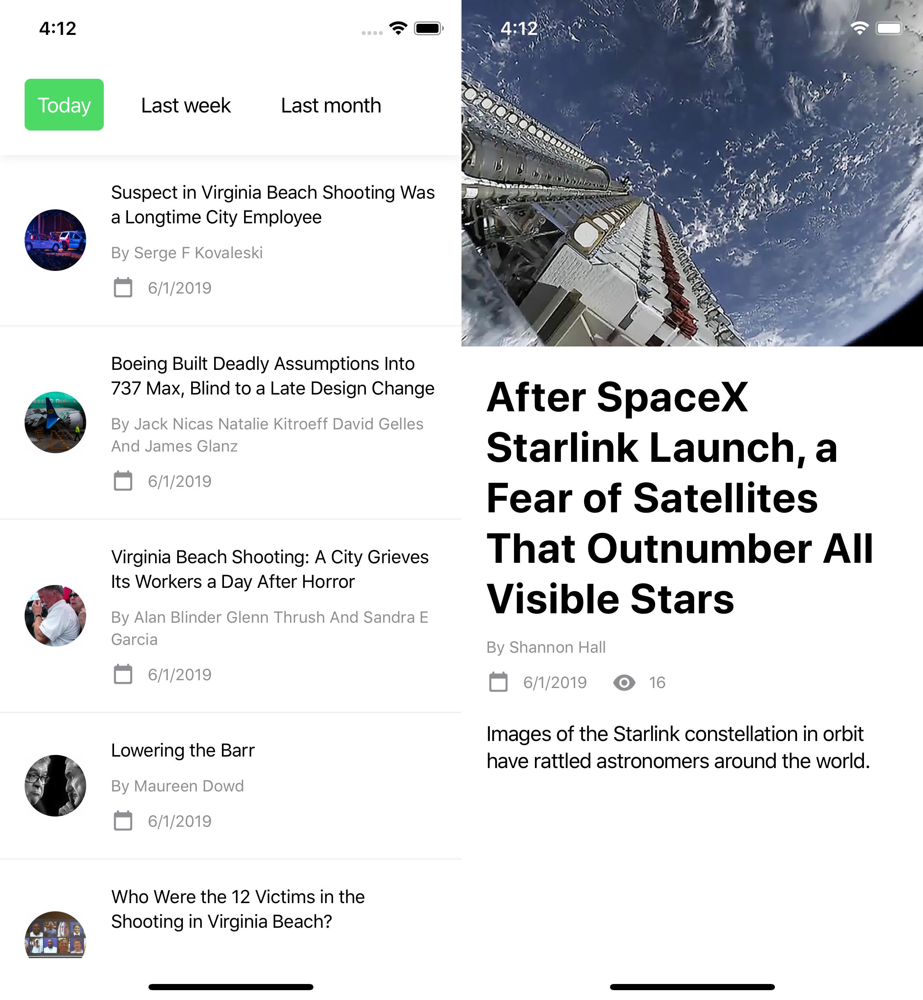

# NY Times

## Running

### Prerequisites

1. [Node](https://nodejs.org/en/)
2. [Yarn](https://yarnpkg.com/en/)
3. [Watchman](https://facebook.github.io/watchman/)
4. [React Native CLI](https://facebook.github.io/react-native/docs/getting-started.html)
5. [Xcode](https://developer.apple.com/xcode/) or [Android Studio](https://developer.android.com/studio)

#### Environment

You need to setup a `.env` file with the following variables;

```
API_KEY=YOUR_KEY_HERE
API_URI=https://api.nytimes.com/svc/mostpopular/v2/mostviewed/all-sections
```

### Guide

1. `git clone https://github.com/alizahid/nytimes`
2. `cd nytimes`
3. `yarn`
4. `yarn start`
5. `yarn ios` or `yarn android`

#### Running on Android

To run the app on Android, have an emulator running or a device connected before you `yarn android`.

## Testing

1. `yarn test`

You can safely ignore warnings similar to these;

```
Warning: An update to Home inside a test was not wrapped in act(...).
```

They're from a bug in `react-test-renderer` and will be fixed in `16.9.0`.

### Coverage

After you've run the tests, you can view coverage with `open coverage/index.html`.

## About

This project uses the most cutting edge tech available.

- [TypeScript](https://www.typescriptlang.org/)
- [React Hooks](https://reactjs.org/docs/hooks-intro.html)
- [easy-peasy](https://github.com/ctrlplusb/easy-peasy)
- ES9 features such as object spread

## Screenshots

### iOS



### Android


