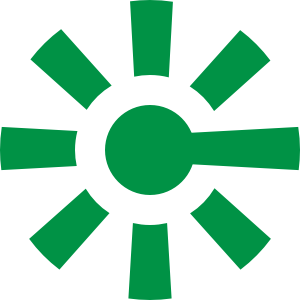

# Corona Stats

## Dev

### Prerequisites

- Git
- Node
- Xcode
- Android Studio
- watchman
- Flipper

### Instructions

Start by cloning this repo and setting up the `.env` file. Run `cp .env.example .env` to create the `.env` file. You'll need to grab a key from [positionstack](https://positionstack.com).

Then install dependencies with `yarn` and `npx pod-install`.

`yarn start` will start the bundler.

For iOS, `yarn ios` will boot up a simulator and run the app.

If you run into signing issues, open the Pods project in Xcode, and change the project team to yours.

For Android, you'll need to boot up an emulator. Then you can `yarn android` to start the app.

### Deeplinks

I've added several deep links to different screens. You can test them on the iOS simulator with the following commands.

| Command                                            |    Screen     |
| -------------------------------------------------- | :-----------: |
| `npx uri-scheme open corona://home --ios`          |     Home      |
| `npx uri-scheme open corona://user --ios`          |     User      |
| `npx uri-scheme open corona://profile --ios`       |    Profile    |
| `npx uri-scheme open corona://location/ip --ios`   | Location map  |
| `npx uri-scheme open corona://location/list --ios` |  Location IP  |
| `npx uri-scheme open corona://location/map --ios`  | Location list |

You can replace `--ios` with `--android` to test them on Android emulator.

## Design

I've built a very clean and minimal app with a heavy focus on typography and iconography. I'm using Inter for body text, Poppins for headings and titles, Ionicons for icons.

The app has full support for localization and RTL layouts. I've added Arabic and Urdu with language switching and restart in app to make this easier to test.

I also built a custom icon inspired by something I saw on Dribbble.

I've added three themes and languages. Screenshots for both are in the `assets/screenshots` directory.

## Tech

I've built this with TypeScript, using `react-sweet-state` for state management, `react-intl` for internationalization, and `react-native-fast-image` for images.

I haven't translated anything in Arabic or Urdu, because I can't write any of the languages.

I also built a custom calendar component because I wasn't happy with the alternatives.

For native APIs, I went with maps and geolocation. Because of the topic I chose (Corona stats), I couldn't figure out where to put in camera or push notification usage in the app.
